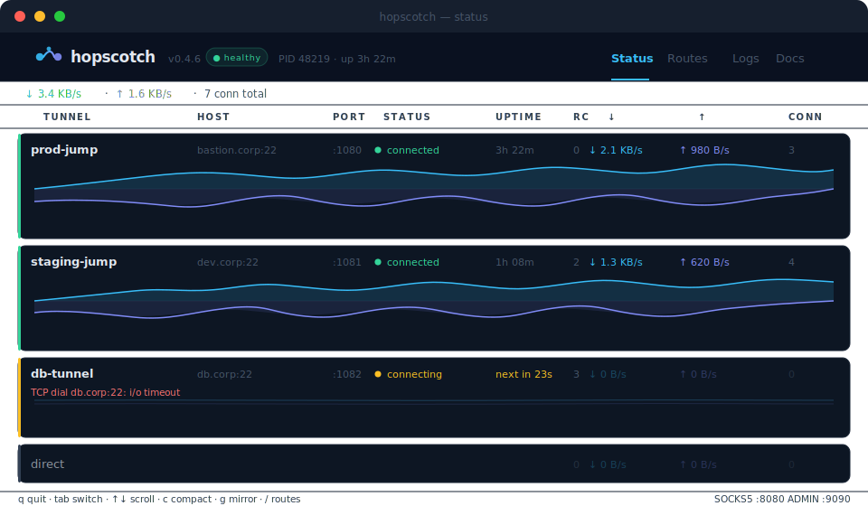
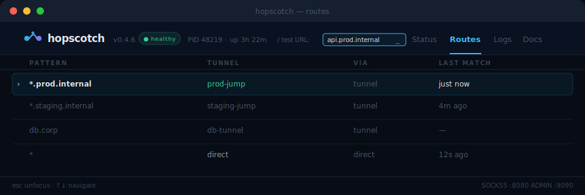
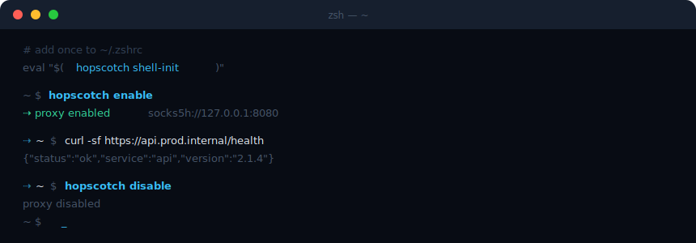
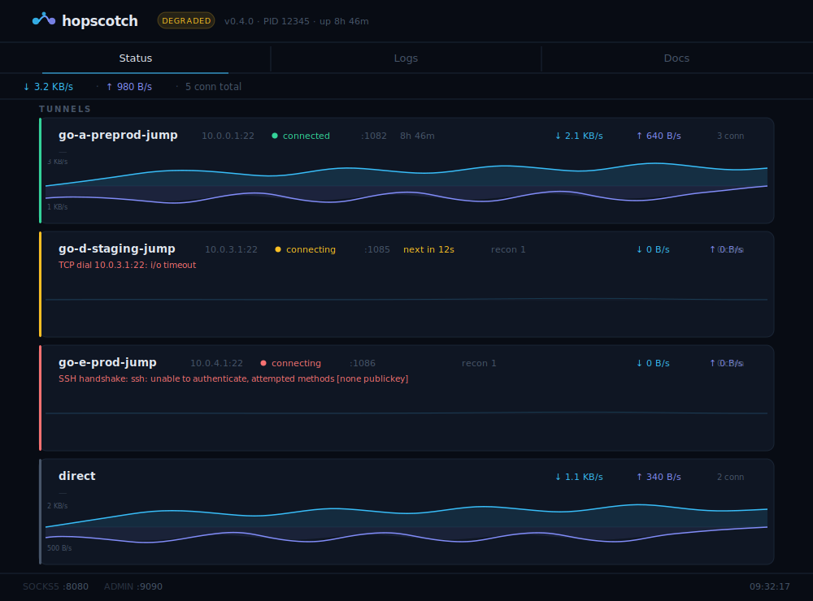

# hopscotch

> SSH tunnels that reconnect themselves. A smart SOCKS5 router that sends each request through the right tunnel — automatically.

[](https://github.com/pottom/hopscotch/releases/latest)
[](LICENSE)
[](go.mod)



---

**hopscotch** manages your SSH tunnels and routes outgoing connections through them automatically — like a personal VPN router for jump hosts. It watches your tunnels, reconnects them in seconds when they drop, and handles the `HTTP_PROXY` setup so your dev tools just work without per-app configuration.

One binary. Zero services.

## What you get

| | |
|---|---|
| **Auto-reconnect** | Exponential backoff, keepalive-based dead-connection detection in seconds, not minutes |
| **Smart routing** | One SOCKS5 port, pattern rules (`*.prod.internal → prod-jump`), first-match wins |
| **TUI dashboard** | Live tunnel cards with dual-channel traffic graphs, reconnect countdowns, log streaming |
| **Shell integration** | `hopscotch enable` / `disable` like Python venv — sets and restores `HTTP_PROXY` in the current shell |
| **Web UI** | Same data as TUI, in the browser at `localhost:9090`, with live SSE updates |
| **VPN integration** | Manages openconnect VPN as a subprocess; tunnels wait for VPN before connecting |
| **Self-update** | `hopscotch update` fetches and atomically replaces the binary; container-aware |
| **Hot reload** | Config reloads on `SIGHUP` or file change, no restart needed |
| **SSH agent** | Works with YubiKey, gpg-agent, and ssh-agent out of the box |

## TUI dashboard

`hopscotch status` opens a live terminal dashboard with four tabs: Status, Patterns, Logs, and Docs.


The Status tab shows a **VPN table** (if configured) and a **Tunnel table**. Each tunnel card shows: status dot, host, local SOCKS5 port, uptime, reconnect counter, per-second throughput, active connections, and reason (e.g. `waiting for VPN: corp-vpn`).

Press `f` to toggle graphs on/off (compact mode is the default). Press `g` to toggle mirror mode. Press `q` to quit.

When a newer version is available, a `⚡v0.5.1` indicator appears next to the current version in both the TUI and web UI.

## Routing patterns

The **Patterns tab** shows exactly which hostname patterns route to which tunnel. Press `/` to focus the URL tester — type any hostname and hopscotch highlights the matching rule in real time.



Rules are evaluated top-to-bottom; the first match wins. Patterns support wildcard prefix (`*.example.com`), wildcard suffix (`10.0.1.*`), exact hostnames, and `*` as a catch-all for direct connections.

## Shell integration

Works like Python venv — `enable` captures and exports the proxy env, `disable` restores exactly what was there before.



Add once to `~/.zshrc` or `~/.bashrc`:

```bash
eval "$(hopscotch shell-init)"
```

Then toggle per-shell:

```bash
hopscotch enable    # sets HTTP_PROXY, HTTPS_PROXY, NO_PROXY in current shell
hopscotch disable   # restores the previous environment exactly
```

Without `shell-init`, `enable`/`disable` print the export statements but can't apply them — hopscotch will warn you with the fix. For a quick one-off: `eval "$(hopscotch enable)"`.

When the proxy is active, `HOPSCOTCH_ACTIVE` is exported so your prompt or scripts can react to it.

## Web admin UI

The web dashboard lives at `http://localhost:9090`. It mirrors the TUI — tunnel cards with live traffic graphs, a Patterns tab with interactive URL tester, VPN status cards, and a Logs tab streaming structured output in real time. No polling, pure SSE.



## Installation

### One-liner

```bash
curl -fsSL https://raw.githubusercontent.com/pottom/hopscotch/main/install.sh | bash
```

Detects platform (macOS/Linux, amd64/arm64) and installs the latest release to `/usr/local/bin`.

### Self-update

Once installed, keep it current with:

```bash
hopscotch update          # check and update
hopscotch update --check  # check only, print version if newer
```

Atomically replaces the binary. Prints an explicit message instead of silently updating when running inside a container.

### From source

```bash
git clone https://github.com/pottom/hopscotch.git
cd hopscotch
./build.sh binary   # → dist/hopscotch
```

### Docker

```bash
docker pull ghcr.io/pottom/hopscotch:latest
```

## Quick start

1. Copy and edit the example config:
   ```bash
   cp hopscotch.example.yaml hopscotch.yaml
   ```

2. Trust your SSH hosts (first run):
   ```bash
   hopscotch trust all
   ```

3. Load shell integration (once, in `~/.zshrc` or `~/.bashrc`):
   ```bash
   eval "$(hopscotch shell-init)"
   ```
   > **Required** for `hopscotch enable` / `disable` to work. Without this, the commands only print the export statements — they don't apply them to your shell. For a one-time workaround: `eval "$(hopscotch enable)"`.

4. Start:
   ```bash
   hopscotch start
   ```

5. Route traffic:
   ```bash
   # per-request
   curl -x socks5h://localhost:8080 https://internal.service.corp

   # or activate for the whole shell session
   hopscotch enable
   curl https://internal.service.corp
   ```

## Configuration

See [`hopscotch.example.yaml`](hopscotch.example.yaml) for a full annotated example. Minimal working config:

```yaml
tunnels:
  - name: prod-jump
    host: bastion.corp
    port: 22
    user: alice
    local_port: 1080
    keepalive_interval: 5      # seconds between keepalive probes
    keepalive_max_fails: 2     # consecutive failures → reconnect
    reconnect_delay: 5         # initial backoff (doubles each retry)
    reconnect_max_delay: 30    # cap

  - name: staging-jump
    host: dev.corp
    port: 22
    user: alice
    identity_file: ~/.ssh/id_rsa
    local_port: 1081

proxy:
  port: 8080
  no_proxy: "localhost,127.0.0.1,::1"   # used by `hopscotch enable`
  shell_icon: "⇢"                         # exported as HOPSCOTCH_ACTIVE
  rules:
    - pattern: "*.prod.internal"
      tunnel: prod-jump
    - pattern: "*.staging.internal"
      tunnel: staging-jump
    - pattern: "*"
      via: direct

admin:
  port: 9090
  bind: "127.0.0.1"    # set to 0.0.0.0 to expose in containers
```

### Tunnel options

| Field | Default | Description |
|-------|---------|-------------|
| `name` | — | Unique tunnel name (referenced in proxy rules) |
| `host` | — | SSH server hostname or IP |
| `port` | `22` | SSH server port |
| `user` | — | SSH username |
| `identity_file` | — | Path to private key; omit to use SSH agent |
| `local_port` | — | Local SOCKS5 port for this tunnel |
| `requires_vpn` | — | Name of a `vpn` entry; tunnel waits for VPN before connecting |
| `dial_timeout` | `30` | TCP connect + SSH handshake timeout (seconds) |
| `keepalive_interval` | `5` | Keepalive probe interval (seconds) |
| `keepalive_max_fails` | `2` | Consecutive failures before reconnect |
| `reconnect_delay` | `5` | Initial reconnect backoff (doubles each attempt) |
| `reconnect_max_delay` | `30` | Reconnect backoff cap (seconds) |
| `force_pty` | `false` | Open a PTY shell session — for jump hosts that enforce channel policies (SPS/SCB) |

### VPN integration

hopscotch can manage an **openconnect** VPN subprocess and make tunnels wait for it before connecting:

```yaml
vpn:
  - name: corp-vpn
    type: openconnect
    server: https://vpn.corp.com
    authgroup: "Engineering"
    user: alice
    sudo: true                    # run openconnect via sudo
    ping_host: "10.0.0.1:22"     # TCP probe to confirm VPN connectivity
    pre_connect:                  # commands to run before each connection attempt
      - "sudo networksetup -setdnsservers Wi-Fi Empty"
    reconnect_delay: 15
    reconnect_max_delay: 120

tunnels:
  - name: prod-jump
    requires_vpn: corp-vpn        # waits for VPN; shows reason in TUI/web UI
    host: 10.0.0.10
    ...
```

The password is stored securely in the OS keychain (macOS Keychain / Linux Secret Service) on first use. hopscotch validates that `sudo` can run openconnect before daemonizing, and kills the entire openconnect process group on shutdown.

#### VPN options

| Field | Default | Description |
|-------|---------|-------------|
| `name` | — | Unique VPN name (referenced by `requires_vpn`) |
| `type` | — | `openconnect` (only supported type) |
| `server` | — | VPN server URL |
| `user` | — | VPN username |
| `authgroup` | — | Authentication group / realm |
| `sudo` | `false` | Run openconnect via `sudo` |
| `binary` | `openconnect` | Path to openconnect binary |
| `ping_host` | — | `host:port` TCP probe to confirm VPN is up |
| `pre_connect` | — | Shell commands to run before each connection attempt |
| `extra_args` | — | Additional openconnect flags (managed flags like `--user` are rejected) |
| `reconnect_delay` | `15` | Initial reconnect backoff (seconds) |
| `reconnect_max_delay` | `120` | Reconnect backoff cap (seconds) |

### Proxy rules

| Pattern | Example | Matches |
|---------|---------|---------|
| Wildcard prefix | `*.example.com` | `foo.example.com`, `bar.example.com` |
| Wildcard suffix | `10.0.1.*` | `10.0.1.1` … `10.0.1.254` |
| Exact | `db.internal` | `db.internal` only |
| Catch-all | `*` | everything |

`via: direct` bypasses all tunnels.

## Commands

```
hopscotch start              # start daemon (detaches from terminal)
hopscotch start --foreground # stay in foreground (for Docker, systemd)
hopscotch start --restart    # replace running instance without prompting
hopscotch stop               # stop the daemon
hopscotch status             # open interactive TUI (plain text when piped)
hopscotch enable             # activate proxy in current shell
hopscotch disable            # deactivate proxy, restore previous env
hopscotch shell-init         # print shell integration (source once in .zshrc)
hopscotch update             # check for newer release and update the binary
hopscotch update --check     # check only, do not download
hopscotch trust <name|host|all>  # add SSH host key to known_hosts
hopscotch validate           # validate the config file
hopscotch version            # print version info
```

Global flags: `--config <path>` · `--verbose` · `--log-file <path>`

### TUI key bindings

| Key | Action |
|-----|--------|
| `Tab` / `s` / `l` / `p` | Switch tabs (Status → Logs → Patterns → Docs) |
| `↑` `↓` / `j` `k` | Scroll |
| `/` | Focus URL tester (Patterns tab) |
| `Esc` | Unfocus tester |
| `f` | Toggle graphs on/off (format) |
| `g` | Toggle mirror graph (dual-channel ↔ download only) |
| `q` / `Ctrl+C` | Quit |

## Docker

```bash
docker run -d \
  -v $(pwd)/hopscotch.yaml:/etc/hopscotch/config.yaml:ro \
  -v ~/.ssh/known_hosts:/home/hopscotch/.ssh/known_hosts:ro \
  -v ~/.ssh/id_rsa:/etc/hopscotch/keys/id_rsa:ro \
  -p 8080:8080 \
  -p 9090:9090 \
  ghcr.io/pottom/hopscotch:latest
```

Or with Compose — see [`deploy/docker-compose.yml`](deploy/docker-compose.yml).

Set `admin.bind: "0.0.0.0"` when running in a container so the admin port is reachable from the host. `hopscotch update` prints an explicit notice inside containers instead of updating — update the image instead.

## Prometheus metrics

Metrics are exposed at `/metrics` in Prometheus text format:

| Metric | Type | Description |
|--------|------|-------------|
| `hopscotch_tunnel_status` | gauge | `1` = connected; label `tunnel` |
| `hopscotch_tunnel_uptime_seconds` | gauge | Seconds since last connect |
| `hopscotch_tunnel_reconnects_total` | counter | Total reconnect attempts |
| `hopscotch_tunnel_bytes_in_total` | counter | Cumulative bytes received |
| `hopscotch_tunnel_bytes_out_total` | counter | Cumulative bytes sent |
| `hopscotch_tunnel_active_connections` | gauge | Current open connections |
| `hopscotch_direct_bytes_in_total` | counter | Bytes via direct path |
| `hopscotch_direct_bytes_out_total` | counter | Bytes via direct path |
| `hopscotch_direct_active_connections` | gauge | Current direct connections |
| `hopscotch_vpn_status` | gauge | `2` = connected, `1` = connecting, `0` = disconnected; label `vpn` |
| `hopscotch_vpn_uptime_seconds` | gauge | Seconds since VPN connected |
| `hopscotch_vpn_reconnects_total` | counter | Total VPN reconnect attempts |

```promql
rate(hopscotch_tunnel_bytes_in_total{tunnel="prod-jump"}[1m])
```

## Building

```bash
./build.sh binary        # local binary → dist/hopscotch
./build.sh binary-all    # all platforms → dist/
./build.sh container     # multiarch Docker image (local, no push)
./build.sh publish       # build + push to ghcr.io
./build.sh release       # binary-all + publish
```

## License

MIT
