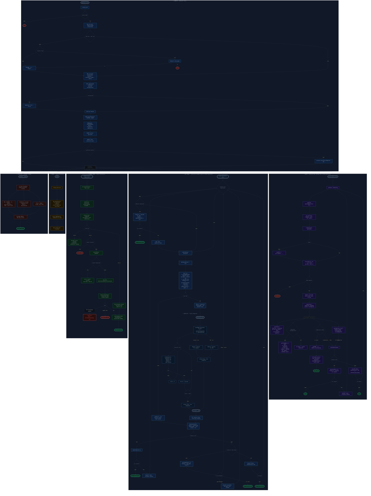

# Hopscotch – teljes lifecycle flowchart

> Renderelés: [mermaid.live](https://mermaid.live), GitHub, VS Code Markdown Preview Enhanced

```mermaid
%%{init: {
  "theme": "base",
  "themeVariables": {
    "background":        "#0d1117",
    "primaryColor":      "#1e2d3e",
    "primaryTextColor":  "#e2e8f0",
    "primaryBorderColor":"#334155",
    "lineColor":         "#475569",
    "edgeLabelBackground": "#0d1117",
    "clusterBkg":        "#111827",
    "clusterBorder":     "#1e2d3e",
    "titleColor":        "#94a3b8",
    "fontFamily":        "monospace"
  }
}}%%
flowchart TB

classDef term_ok  fill:#0a2318,stroke:#34d399,stroke-width:2px,color:#34d399
classDef term_err fill:#2b0d0d,stroke:#f87171,stroke-width:2px,color:#f87171
classDef term_neu fill:#0f1c2e,stroke:#94a3b8,stroke-width:2px,color:#94a3b8
classDef proc_su  fill:#0d1f3c,stroke:#38bdf8,stroke-width:1px,color:#cbd5e1
classDef proc_vp  fill:#16103a,stroke:#818cf8,stroke-width:1px,color:#cbd5e1
classDef proc_tn  fill:#0d1f3c,stroke:#7dd3fc,stroke-width:1px,color:#cbd5e1
classDef proc_ka  fill:#0a1728,stroke:#60a5fa,stroke-width:1px,color:#cbd5e1
classDef proc_pr  fill:#0a2318,stroke:#34d399,stroke-width:1px,color:#cbd5e1
classDef proc_sh  fill:#1e1500,stroke:#fbbf24,stroke-width:1px,color:#cbd5e1
classDef proc_sd  fill:#200f0f,stroke:#f87171,stroke-width:1px,color:#cbd5e1
classDef dec      fill:#111827,stroke:#475569,stroke-width:1px,color:#94a3b8
classDef parallel fill:#0d1117,stroke:#334155,stroke-width:2px,color:#64748b,font-style:italic

%% ═══════════════════════════════════════════════════════════
%% INDÍTÁS
%% ═══════════════════════════════════════════════════════════
subgraph SU["🚀  INDÍTÁS — hopscotch start"]
  direction TB
  su0([hopscotch start]) --> su1[config.Load]
  su1 --> su1e{parse hiba?}
  su1e -->|igen| su1x([exit])
  su1e -->|nem| su2[SSH kulcsfájl jogosultságok\nellenőrzése]
  su2 --> su3{PID fájl + már fut?}
  su3 -->|igen| su4{--restart flag?}
  su4 -->|igen| su5["SIGTERM → 5s → SIGKILL"]
  su4 -->|nem| su6[Restart? y/N prompt]
  su6 -->|N| su6x([exit])
  su6 -->|y| su5
  su5 --> su7
  su3 -->|nem| su7["VPN jelszavak biztosítása:\nkeychain → interaktív prompt → mentés"]
  su7 --> su8["sudo jogosultság ellenőrzés\n(ha VPN konfigurálva)"]
  su8 --> su9{--foreground?}
  su9 -->|nem| su10[daemonize: fork + setsid]
  su10 --> su11
  su9 -->|igen| su11[PID fájl mentése]
  su11 --> su12["signal.NotifyContext: SIGTERM, SIGINT"]
  su12 --> su13["VPNManager, TunnelManager,\nRouter, ProxyServer, AdminServer"]
  su13 --> su14[SIGHUP watcher goroutine]
  su14 --> su15[update check goroutine async]
  su15 --> su16{publicIP watcher?}
  su16 -->|igen| su17[netcheck.StartPublicIPWatcher 60s]
  su16 -->|nem| su18
  su17 --> su18[["errgroup — párhuzamos goroutinok indítása"]]
end

%% ═══════════════════════════════════════════════════════════
%% VPN LIFECYCLE
%% ═══════════════════════════════════════════════════════════
subgraph VPN["🔒  VPN — Connection.Run (minden VPN-re külön goroutine)"]
  direction TB
  vn0([VPN goroutine indul]) --> vn1[setState: Connecting]
  vn1 --> vn2["orphaned openconnect procs kill"]
  vn2 --> vn3["tun-interfész snapshot: utun*, tun* before"]
  vn3 --> vn4[runPreConnect parancsok]
  vn4 --> vn4e{hiba?}
  vn4e -->|igen| vn4b["lastError = pre_connect: ..."]
  vn4b --> vn5
  vn4e -->|nem| vn5["resolveServer via 1.1.1.1:53\nmax 30s, retry 2s"]
  vn5 --> vn5e{DNS timeout?}
  vn5e -->|igen| vn_rc([reconnect])
  vn5e -->|nem| vn6["macOS: stale VPN server host route törlése"]
  vn6 --> vn7["openconnect subprocess indítása\n(sudo if configured)"]
  vn7 --> vn8[["párhuzamos watcherek"]]

  vn8 --> ws["watchStderr:\nDTLS/TLS → Connected\nSet up tun device → iface\nError/Failed → lastError"]
  vn8 --> wu["watchUplink 2s poll:\nhálózat nélkül → killProcGroup → killedByUplink"]
  vn8 --> pp{ping_host konfigurálva?}
  pp -->|igen| ppy["pollPingHost 1s poll:\n2x TCP OK → Connected\n3x fail post-connect → SIGTERM\n30s timeout → SIGTERM restart"]
  pp -->|nem| ppn["8s delay → assume Connected"]
  vn8 --> vn9{subprocess kilép}

  vn9 -->|ctx.Done| vn10["SIGTERM → 4s → SIGKILL processgroup"]
  vn10 --> vn11["runPostDisconnect:\npost_disconnect parancsok\nmacOS DNS restore\nroute flush"]
  vn11 --> vn_end([clean exit])

  vn9 -->|természetes / hiba| vn12[runPostDisconnect]
  wu -->|killedByUplink| vn12

  vn12 --> vn13{hálózat van?}
  vn13 -->|nem| vn14["WaitForUplink ctx\nlastError = waiting for network"]
  vn14 --> vn14c{ctx cancel?}
  vn14c -->|igen| vn_end2([exit])
  vn14c -->|nem| vn14r["backoff reset, reconnect azonnal"]
  vn14r --> vn1

  vn13 -->|igen| vn15["backoff delay\nexponenciális, max = reconnect_max_delay"]
  vn15 --> vn16{ctx.Done?}
  vn16 -->|igen| vn_end3([exit])
  vn16 -->|nem| vn1
end

%% ═══════════════════════════════════════════════════════════
%% TUNNEL LIFECYCLE
%% ═══════════════════════════════════════════════════════════
subgraph TUN["🔑  SSH TUNNEL — Tunnel.Run (minden tunnel-re külön goroutine)"]
  direction TB
  tn0([Tunnel goroutine indul]) --> tn1{requires_vpn beállítva?}
  tn1 -->|igen| tn2{VPN már connected?}
  tn2 -->|nem| tn3["lastError = waiting for VPN: ...\nvpnGate → WaitConnected 1s poll"]
  tn3 --> tn3c{ctx cancel?}
  tn3c -->|igen| tn_end0([exit Disconnected])
  tn3c -->|nem| tn4["VPN ready, lastError clear"]
  tn4 --> tn5
  tn2 -->|igen| tn5
  tn1 -->|nem| tn5[runPreConnect parancsok]
  tn5 --> tn6["NextReconnectAt = zero"]
  tn6 --> tn7["dial ctx:\n1. buildSSHConfig:\n   identity_file → ssh-agent → default key\n2. net.Dial TCP, KeepAlive 15s\n3. ssh.NewClientConn handshake\n4. force_pty: openPTYSession + agent -A"]
  tn7 --> tn7e{dial OK?}
  tn7e -->|hiba| tn7b["lastError = err\nlog Warn tunnel dial failed"]
  tn7b --> tn8
  tn7e -->|OK| tn7ok["Status = Connected\nConnectedAt = now\nbackoff reset"]
  tn7ok --> ka0

  subgraph KA["💓  KEEPALIVE — Tunnel.keepalive"]
    direction TB
    ka0([keepalive start]) --> kad["watchDeps goroutine 2s poll:\n1. netcheck.HasUplink\n2. vpnIsConnected"]
    kad --> ka1{interval tick}
    ka1 --> ka2["sendKeepalive: keepalive at openssh.com\ntimeout = dial_timeout"]
    ka2 --> ka3{OK?}
    ka3 -->|igen| ka4[fails = 0]
    ka4 --> ka1
    ka3 -->|hiba| ka5["fails++, log Warn"]
    ka5 --> ka6{fails >= max?}
    ka6 -->|nem| ka1
    ka6 -->|igen| ka7["client.Close, exit keepalive"]
    ka7 --> kaex([reconnect loop])
    kad -->|network lost| kadl["depLost: waiting for network"]
    kad -->|VPN lost| kadl2["depLost: waiting for VPN"]
    kadl --> kadx["client.Close, exit keepalive"]
    kadl2 --> kadx
    kadx --> kaex
  end

  kaex --> tn7ok2["PTY session Close (force_pty esetén)"]
  tn7ok2 --> tn8
  tn8["ReconnectCount++\nStatus = Connecting\nConnectedAt = zero\nclient = nil"] --> tn9{hálózat van?}
  tn9 -->|nem| tn10[WaitForUplink ctx]
  tn10 --> tn10c{ctx cancel?}
  tn10c -->|igen| tn_end1([exit Disconnected])
  tn10c -->|nem| tn10r["backoff reset, reconnect azonnal"]
  tn10r --> tn1
  tn9 -->|igen| tn12{lastError auth hiba?}
  tn12 -->|igen| tn13["watchAgentKeys ctx\nYubiKey / gpg-agent figyelés"]
  tn13 --> tn14{mi történik?}
  tn14 -->|agentChanged| tn15["azonnali újrapróba: SSH agent keys changed"]
  tn15 --> tn1
  tn14 -->|ctx.Done| tn_end2([exit Disconnected])
  tn14 -->|delay lejárt| tn1
  tn12 -->|nem| tn16["backoff delay, exponenciális max"]
  tn16 --> tn16c{ctx.Done?}
  tn16c -->|igen| tn_end3([exit Disconnected])
  tn16c -->|nem| tn1
end

%% ═══════════════════════════════════════════════════════════
%% PROXY KÉRÉS
%% ═══════════════════════════════════════════════════════════
subgraph PR["🌐  PROXY KÉRÉS — Router.DialContext"]
  direction TB
  pr0([SOCKS5 kliens kapcsolódik]) --> pr1["net.SplitHostPort → host, port"]
  pr1 --> pr2["inferProto: ssh/tcp/22, https/tcp/443, tcp/9999 ..."]
  pr2 --> pr3["resolve host: szabályok top→bottom, first match wins"]
  pr3 --> pr4{rule.Via}
  pr4 -->|direct| pr5["DirectCounter dialer\nlog proto host pattern via"]
  pr4 -->|block| pr6["log Warn proxy blocked\nerrBlocked → connection refused"]
  pr4 -->|tunnel| pr7{tunnel létezik?}
  pr7 -->|nem| pr7e([config hiba])
  pr7 -->|igen| pr9["tunnelStatus snapshot"]
  pr9 --> pr10{tunnel Connected?}
  pr10 -->|nem| pr11["error: tunnel offline\nfail-fast, nem vár"]
  pr10 -->|igen| pr12["log Info proto/host/pattern/via/tunnel"]
  pr12 --> pr13["tunnel.DialContext: client.Dial SSH forward channel"]
  pr13 --> pr13e{OK?}
  pr13e -->|TCP forwarding denied| pr14["log Error\nhint: AllowTcpForwarding yes"]
  pr13e -->|egyéb hiba| pr15([connection error])
  pr13e -->|OK| pr16["countingConn wrap:\nactiveConns++, bytesIn/Out atomic"]
  pr5 --> pr16
  pr16 --> pr17([connection open])
end

%% ═══════════════════════════════════════════════════════════
%% SIGHUP
%% ═══════════════════════════════════════════════════════════
subgraph SH["🔄  SIGHUP — config újratöltés"]
  direction LR
  sh0([SIGHUP]) --> sh1[config.Load újra]
  sh1 --> sh2["mgr.ApplyConfig:\núj tunnellek indítása\ntörölt tunnellek leállítása"]
  sh2 --> sh3["router.UpdateRules: szabályok hot-swap"]
  sh3 --> sh4[SSH config fájl frissítés]
end

%% ═══════════════════════════════════════════════════════════
%% LEÁLLÍTÁS
%% ═══════════════════════════════════════════════════════════
subgraph SD["🛑  LEÁLLÍTÁS — SIGTERM / SIGINT"]
  direction TB
  sd0([SIGTERM / SIGINT]) --> sd1["ctx.Done broadcast\nminden goroutine értesül"]
  sd1 --> sd2["VPN: SIGTERM → 4s → SIGKILL\npost_disconnect + DNS + route flush"]
  sd1 --> sd3["Tunnellek: ctx.Done → keepalive exit\nStatus = Disconnected"]
  sd1 --> sd4["Proxy + Admin: accept loop leáll"]
  sd2 --> sd5["stateMgr.Remove, PID fájl törlés"]
  sd3 --> sd5
  sd4 --> sd5
  sd5 --> sd6([process exit 0])
end

%% ═══════════════════════════════════════════════════════════
%% ÖSSZEKÖTÉSEK
%% ═══════════════════════════════════════════════════════════
su18 --> vn0
su18 --> tn0
su18 --> pr0
su18 --> sd0
su18 --> sh0

%% ── class assignments ───────────────────────────────────────
class su0 term_neu
class su1,su2,su5,su6,su7,su8,su10,su11,su12,su13,su14,su15,su17 proc_su
class su1e,su3,su4,su9,su16 dec
class su1x,su6x term_err
class su18 parallel

class vn0 term_neu
class vn1,vn2,vn3,vn4,vn4b,vn5,vn6,vn7,ws,wu,ppy,ppn,vn10,vn11,vn12,vn14,vn14r,vn15 proc_vp
class vn4e,vn5e,pp,vn9,vn13,vn14c,vn16 dec
class vn_rc term_err
class vn_end,vn_end2,vn_end3 term_ok
class vn8 parallel

class tn0 term_neu
class tn1,tn2,tn3c,tn7e,tn9,tn10c,tn12,tn14,tn16c dec
class tn3,tn4,tn5,tn6,tn7,tn7b,tn7ok,tn7ok2,tn8,tn10,tn10r,tn13,tn15,tn16 proc_tn
class tn_end0,tn_end1,tn_end2,tn_end3 term_ok

class ka0 term_neu
class kad,ka2,ka4,ka5,ka7,kadl,kadl2,kadx proc_ka
class ka1,ka3,ka6 dec
class kaex term_neu

class pr0 term_neu
class pr1,pr2,pr3,pr5,pr6,pr9,pr11,pr12,pr13,pr14,pr16 proc_pr
class pr4,pr7,pr10,pr13e dec
class pr7e,pr14,pr15 term_err
class pr17 term_ok

class sh0 term_neu
class sh1,sh2,sh3,sh4 proc_sh

class sd0 term_neu
class sd1,sd2,sd3,sd4,sd5 proc_sd
class sd6 term_ok
```
